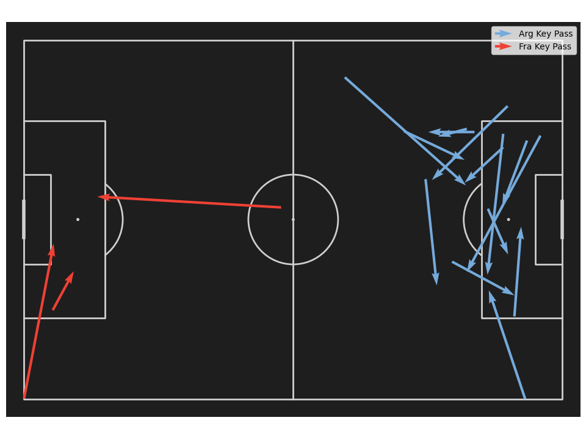

# Hi, I'm Kareem Hany 👋

### Data Science Student · Machine Learning · Sports & Geospatial Analytics

From exploring datasets to building practical applications.

## 👨‍💻 About

I'm a Data Science student based in Egypt, interested in machine learning, football analytics, and GIS. My projects explore property valuation, match event data, and forecasting through Python notebooks and interactive applications.

## 🚀 Featured Projects

### 01 · EstateIQ — Egyptian Property Intelligence

An Egyptian property valuation application combining **XGBoost**, a **FastAPI** service, prediction explanations, and an interactive market dashboard.

**What it delivers:** property estimates with market context and an indicative valuation range; the live dashboard explores **18,620 cleaned listings**.

**Python · XGBoost · FastAPI · Pandas · Vercel**  
[**Try the live app ↗**](https://estate-iq-five.vercel.app/) · [View code](https://github.com/kareimhany74/EstateIQ)

### 02 · World Cup Final — Tactical Analytics

Analyzing Argentina vs. France using StatsBomb event data, pitch maps, and player comparisons.

**A finding from the notebook:** Ángel Di María leads the recorded shot-assist count with **4 passes leading to a shot**. The map above is an original notebook output; blue represents Argentina and red represents France.

**Python · statsbombpy · mplsoccer · Matplotlib**  
[Explore the notebook and visualizations ↗](https://github.com/kareimhany74/worldcup-final-tactical-analytics)

### 03 · Air Passengers — Time Series Forecasting

Comparing ARIMA, seasonal SARIMA, and an MLP regressor on monthly passenger demand.

**Recorded result:** SARIMA achieved **MAE 23.56** and **RMSE 30.14**, in thousands of passengers, on the final **29 months** of the dataset using a chronological 80/20 split. Results are taken from the saved notebook evaluation.

**Python · Statsmodels · Scikit-learn · Pandas**  
[View the forecasting notebook ↗](https://github.com/kareimhany74/air-passengers-time-series)

<b>More projects — prediction, business analytics & GIS</b>

- [Student Scores Prediction](https://github.com/kareimhany74/student-scores-prediction) — regression and classification experiments.
- [Heliopolis Fire Stations](https://github.com/kareimhany74/gis-heliopolis-fire-stations-optimization) — GIS coverage analysis case study.
- [Online Food Delivery Analysis](https://github.com/kareimhany74/online-foods-delivery-analysis) — customer behavior analysis.
- [Barcelona Players Fitness Analytics](https://github.com/kareimhany74/barca-players-fitness-analytics) — sports analytics notebooks.

## 🛠️ Technical Stack

Tools I use across my projects and studies.

### 💻 Programming & Notebooks

  

### 🤖 Machine Learning & Data Analysis

    

### 🧠 Deep Learning

 

### 📊 Visualization, Sports & GIS

    

### 🚀 APIs & Deployment

 

## 📊 GitHub Stats

Repository counts & contribution activity

[View my contribution activity →](https://github.com/kareimhany74#year-list-container)

## 🔗 Connect

Interested in discussing data science, football analytics, or a project? Find me on [LinkedIn](https://www.linkedin.com/in/kareemhany74/) or [email me](mailto:kareimhany74@gmail.com).
